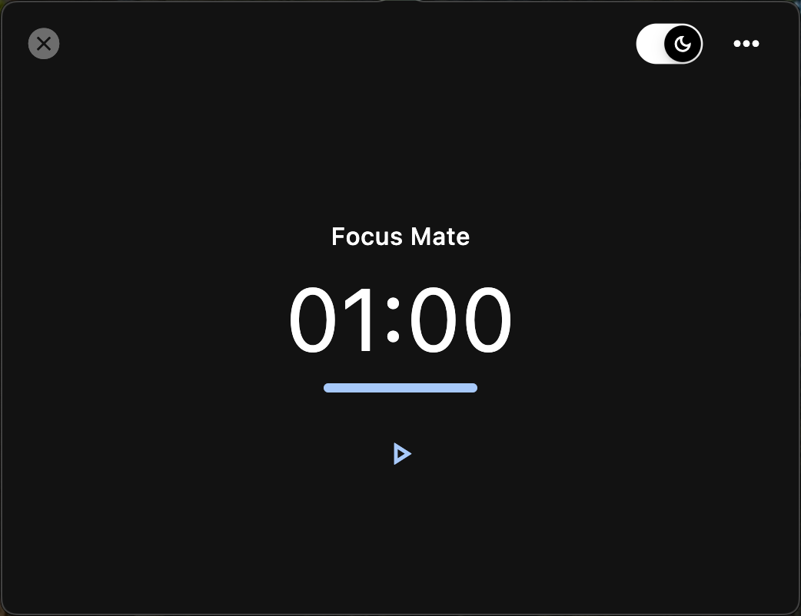
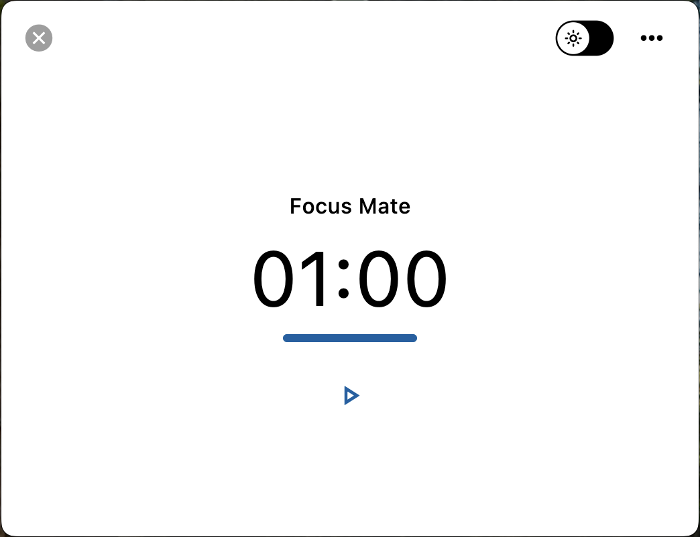
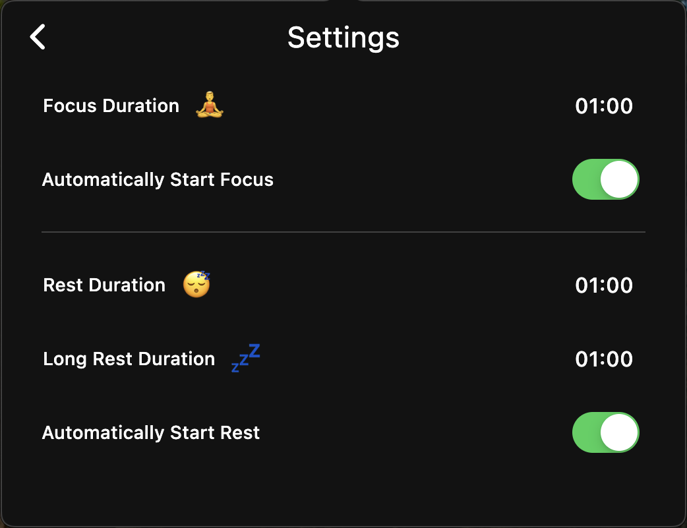
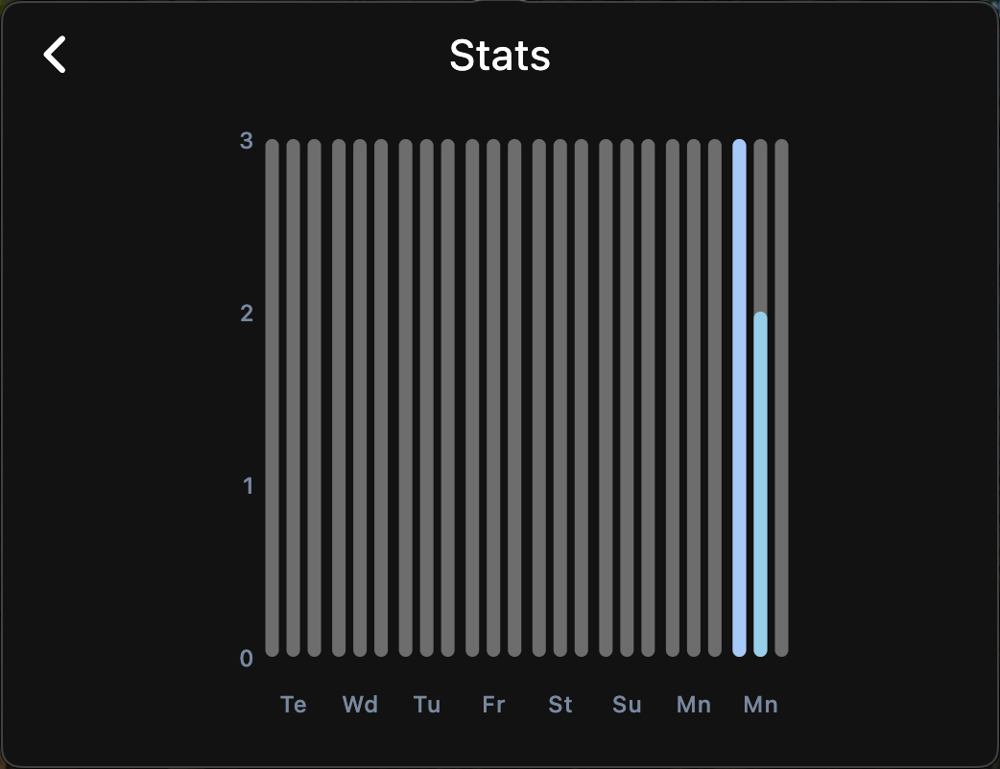

# FocusMate🧘‍♂️

FocusMate is a Flutter desktop application designed to help you focus on your work. With a simple and intuitive interface, it provides tools and techniques to increase productivity, reduce stress, and bring order to your daily workflow.

### Features✨

* **Pomodoro Timer**: Improve concentration and productivity by setting up focused work sessions with customizable durations.
* **Productivity Insights**: Gain detailed statistics and insights about your work habits to understand and enhance your productivity patterns.
* **Custom Work Sessions**: Tailor work sessions to fit your schedule, preferences, and workflow.
* **Break Reminders**: Stay healthy and avoid burnout with customizable break notifications during long work periods.

   
   

_FocusMate supports both Dark and Light mode, ensuring a comfortable working environment for all lighting conditions._

### Screenshots📷

* **Settings**: Customize focus and break durations.

* **Productivity Stats**: Get weekly statistics on your focus and break sessions.

* **Minimal Taskbar Mode**: Keep FocusMate tucked away in your taskbar for easy access while you work.

### Usage📖

* **Start a Session**: Choose the duration and start your focus session.
* **Review Insights**: Check your productivity statistics and analyze your work patterns.
* **Customize Settings**: Adjust your focus and break session durations to suit your workflow preferences.

### Contributing 👨‍💻

We welcome contributions to improve FocusMate! If you have suggestions, find a bug, or want to add a new feature, feel free to submit a pull request or open an issue.